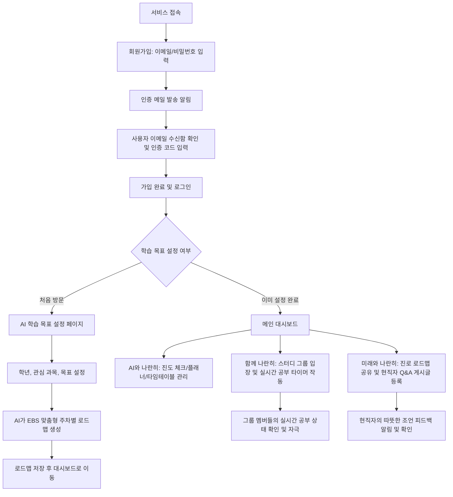

# Mini-PRD: 나란히 (Naran-hi)
교육 격차 해소를 위한 AI 맞춤형 진도 관리 및 인적 네트워크 결합 플랫폼

---

## 1. Objective (목적과 타깃)

### 서비스 목적 (Goal)
* **SDG 4 (양질의 교육)** 달성을 위해, 경제적 여건에 상관없이 모든 학생이 공평하게 배움의 기회를 누리고 성장할 수 있도록 돕습니다.
* AI의 자동화된 로드맵 설계 기능과 따뜻한 학습 커뮤니티(동료 학습, 멘토 피드백)를 융합하여 사교육 격차를 극복하는 자기주도적 학습 환경을 제공합니다.

### 타깃 사용자 (Target User)
* **주 타깃**: 학습 의욕은 높으나, 고가의 과외나 진로 컨설팅을 받기 어려운 저소득층 및 취약계층 중·고등학생.
* **부 타깃**: 
  * 무료 온라인 강의(EBS 등)를 활용하고 있으나, 스스로 학습 계획을 세우거나 진도를 관리하는 데 어려움을 느끼는 학생.
  * 혼자 공부하며 외로움을 느끼고 실시간 학습 자극과 따뜻한 소통이 필요한 독학 수험생.
  * 자신의 경험을 나누고 사회적 가치를 실현하고자 하는 대학생 멘토 및 현직자 전문가.

---

## 2. Scope (개발 범위)

이번 1차 MVP 버전에서는 **이메일 인증 및 비밀번호 회원가입**, **학습 계획 수립/진도 체크(AI)**, **동료와의 자극(공동 타이머)**, **정보 격차 해소(Q&A 및 피드백)**에 집중합니다.

### 핵심 구현 기능 (In-Scope for MVP)

#### ① 이메일 인증 및 비밀번호 기반 회원가입/로그인
* **회원가입**: 사용자는 이메일과 비밀번호를 입력하여 계정을 생성합니다.
* **이메일 본인 인증**: 가입 시 입력한 이메일로 인증 코드(OTP)가 발송되며(Resend API 활용), 이를 확인하여 입력해야만 계정이 활성화됩니다.
* **로그인**: 가입 시 설정한 이메일과 비밀번호를 사용하여 로그인합니다.

#### ② AI와 나란히 (진도 관리 & AI EBS 로드맵)
* **EBS 기반 맞춤형 로드맵 생성**: 사용자의 학년, 목표 대학/과목, 성취도 수준을 입력받아 AI가 최적의 EBS 무료 강의 목록을 매칭하여 주차별(예: 8주 완성) 맞춤 로드맵을 자동으로 설계해 줍니다.
* **진도율 트래커 & 체크리스트**: 사용자가 수강한 EBS 강의를 클릭하여 수강 완료 처리를 할 수 있는 인터페이스를 제공하고, 전체 진척도(%)를 시각화합니다.
* **일간/주간 플래너 (To-Do)**: 사용자가 매일 해야 할 공부나 일정을 등록하고 완료 여부를 체크할 수 있는 플래너 기능을 제공합니다.
* **타임테이블 (Timetable)**: 하루 단위의 일정을 시간 블록으로 관리할 수 있는 시각적인 시간표 위젯을 제공합니다.
* **미이수 리마인드 알림**: 계획된 진도를 달성하지 못했을 때 시각적 대시보드 알림을 제공합니다.

#### ③ 함께 나란히 (실시간 공부 시간 공유)
* **실시간 공부 타이머 (Live Timer)**: 웹 브라우저 내에서 작동하는 스톱워치/뽀모도로 타이머 기능을 제공합니다.
* **스터디 그룹 내 상태 실시간 공유**: 스터디 그룹을 생성하거나 가입하여, 그룹원들의 실시간 학습 상태(`공부 중`, `휴식 중`, `외출 중`)와 당일 누적 학습 시간을 실시간 현황판으로 모니터링하여 자극을 받습니다.

#### ④ 미래와 나란히 (현직자 Q&A 및 로드맵 피드백)
* **직무 전문가 매칭 Q&A 보드**: IT, 경영, 디자인, 공학 등 희망 직무 카테고리별로 현직자 전문가에게 질문할 수 있는 게시판을 제공합니다.
* **로드맵 공유 및 피드백**: 사용자가 수립한 진로/학습 로드맵을 게시글 형태로 공유하면, 해당 분야 현직자가 검토한 후 따뜻한 조언과 현실적인 코칭을 댓글로 남길 수 있는 소통 채널을 구축합니다.

### 당장 구현하지 않을 기능 (Out-of-Scope)

* **멘토와 나란히 (1:1 실시간 화상/음성 멘토링)**
  * *이유*: 실시간 화상/음성 WebRTC 인프라 구축, 정교한 멘토-멘티 시간 예약 캘린더 시스템, 노쇼(No-show) 방지 페널티 정책 등은 개발 복잡도가 매우 높습니다. 
  * *대안*: 1차 MVP 단계에서는 텍스트 기반의 현직자 Q&A 및 로드맵 피드백 기능으로 지식 공유 니즈를 검증하고, 화상 솔루션은 차기 단계로 보류합니다.

---

## 3. User Flow (사용자 흐름 단계)

### 흐름 설명
1. **이메일 인증 및 회원가입**
   * 사용자는 회원가입 시 사용할 이메일과 비밀번호를 입력합니다.
   * 백엔드에서 인증을 위해 해당 이메일로 인증 코드를 발송합니다.
   * 인증 코드를 입력하여 본인 인증을 완료하면 계정이 생성됩니다. 이후에는 이메일과 비밀번호로 로그인합니다.
2. **온보딩 및 AI 로드맵 설계**
   * 유저가 접속 후 본인의 학년(예: 고2), 취약 과목(예: 수학), 학습 목표를 선택합니다.
   * AI가 이에 맞는 무료 EBS 강의를 분석하여 8주 과정 주차별 진도표를 추천합니다.
   * 유저가 만족하면 로드맵을 확정하고 대시보드에 연동합니다.
3. **매일 학습 관리 및 타이머 측정**
   * 대시보드에 들어가 오늘 해야 할 EBS 강의 체크, 플래너 작성, 타임테이블 일정을 확인합니다.
   * 공부를 시작할 때 스터디 룸에 접속해 타이머의 '시작' 버튼을 누릅니다. 나의 상태가 '공부 중'으로 표시되며, 그룹원들의 실시간 공부 타이머와 상태가 함께 나열됩니다.
4. **진로 탐색 및 멘토 피드백**
   * '미래와 나란히' 탭에서 자신이 짠 AI 로드맵과 희망 직무에 대한 고민 글을 작성해 올립니다.
   * 알림을 통해 해당 직무 현직자 멘토가 작성해준 실무 조언 댓글을 확인합니다.

---

## 4. UI/UX Vibe (디자인 프롬프트 묘사)

### English UI/UX Vibe Prompt
> "A cozy, premium, and friendly educational diary and productivity web application. Clean, warm white (#FCFCFA) background with a soft pastel theme featuring warm light pastel blue (#E8F0FE) and soft pastel yellow (#FFF9E6) as repeating accent and button colors. The interface utilizes gentle, smooth drop shadows and highly rounded container corners (border-radius: 16px to 24px) for an approachable, bullet-journal style look. Clean, friendly typography (such as Outfit or Inter sans-serif font). The layout includes interactive cards with cute checkmark icons for EBS lectures, a daily planner checklist, a visual time-block timetable, a beautiful circular digital study timer with smooth micro-animations on play/pause, and a warm, inviting career feedback message board. Design is minimal yet visually rich, evoking safety, warmth, and supportive educational equality."

---

## 5. Verification Plan (검증 계획)

### 주요 검증 시나리오
1. **플래너 및 타임테이블 동작 검증**
   * 플래너(To-Do)에 항목을 추가/삭제하고 체크할 수 있는가?
   * 타임테이블이 시간 블록 단위로 올바르게 표시되는가?
2. **이메일 본인 인증 및 로그인**
   * 회원가입 화면에서 이메일과 비밀번호를 입력하면 해당 이메일로 인증 코드가 발송되는가?
   * 활성화된 계정의 이메일과 비밀번호로 로그인이 성공적으로 이루어지는가?
3. **AI 맞춤형 로드맵 설계 동작 검증**
   * 사용자가 성취 수준과 과목을 선택했을 때 적합한 EBS 추천 강의 리스트가 주차별로 잘 배정되는가?
4. **실시간 스터디 타이머 및 상태 변경 실시간성 검증**
   * 타이머 동작 시 상태(`공부 중` / `휴식 중`)가 화면 및 그룹원 목록에 지연 없이 갱신되는가?
5. **Q&A 게시판 및 피드백 댓글 등록 검증**
   * 학생의 진로 고민 글 작성 후 현직자 계정으로 피드백 댓글을 달았을 때 올바르게 렌더링되는가?
